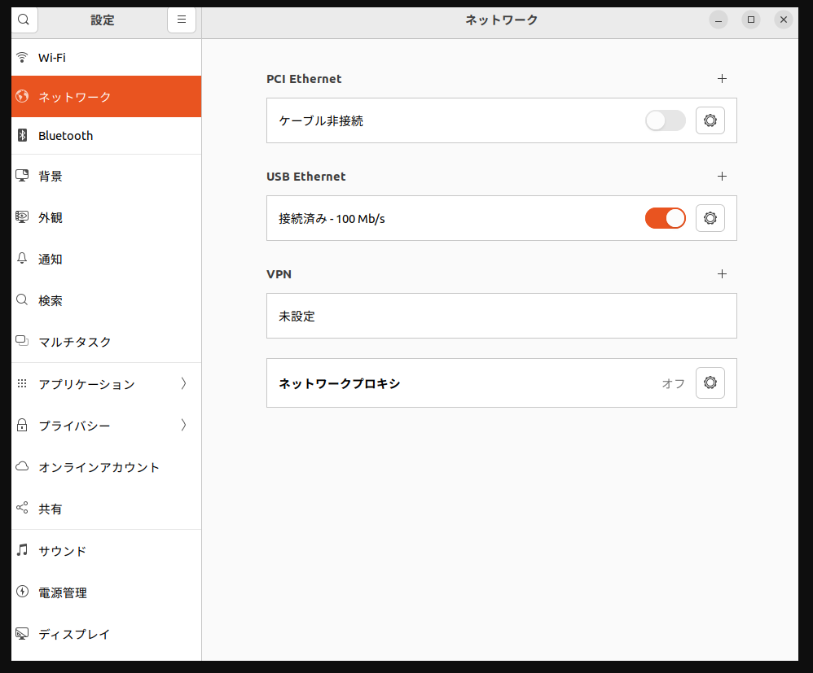

# eth2can

TCP(Ethernet) 接続された CAN ゲートウェイと ROS 2 の `can_msgs/msg/Frame` を相互変換するノードです。

## 概要（eth2can_node.cpp）

- ゲートウェイへ TCP クライアントとして接続し、受信した CAN フレームを ROS 2 トピックに publish
- ROS 2 トピックで受け取った CAN フレームを TCP でゲートウェイへ送信
- チャネル数は 3（`0..2`）固定

### I/F（ROS 2）

**Subscribe**
- `to_can_bus0` (`can_msgs/msg/Frame`)
- `to_can_bus1` (`can_msgs/msg/Frame`)
- `to_can_bus2` (`can_msgs/msg/Frame`)

**Publish**
- `from_can_bus0` (`can_msgs/msg/Frame`)
- `from_can_bus1` (`can_msgs/msg/Frame`)
- `from_can_bus2` (`can_msgs/msg/Frame`)

**Parameters**
- `device_ip` (string, default: `192.168.1.100`)
- `device_port` (int, default: `5000`)
- `tcp_nodelay` (bool, default: `true`) - 小さいパケットの遅延を減らすため `TCP_NODELAY` を有効化

> 注: `can_msgs/msg/Frame` の `data` は 8 byte（通常 CAN）です。`dlc` も 0..8 を前提に扱います。

### I/F（TCP）

TCP で送受信するパケットは `eth2can_node.cpp` 内の `GatewayPacket` / `CanFrame` 構造体定義に準拠します。
`CanFrame::data[64]` を持ちますが、ROS 側は通常 CAN(8 byte) のみを扱うため、送受信では先頭 8 byte を利用します。

## ビルド

ワークスペース直下で:

```bash
colcon build --packages-select eth2can
source install/setup.bash
```

## 実行方法

### 1) デフォルト設定で起動

```bash
ros2 run eth2can eth2can_node
```

起動後、`device_ip=192.168.1.100` / `device_port=5000` へ接続を試みます。
接続に失敗した場合は 1 秒周期で再試行します（受信スレッド側）。

### 2) 接続先を指定して起動（推奨）

```bash
ros2 run eth2can eth2can_node --ros-args -p device_ip:=192.168.1.50 -p device_port:=5000
```

### 3) トピック名をリマップして起動

例: 他ノードのトピック設計に合わせて名前を変える場合

```bash
ros2 run eth2can eth2can_node --ros-args \
  -r to_can_bus0:=/can0/tx \
  -r from_can_bus0:=/can0/rx
```

例: `to_can_bus0` / `from_can_bus0` を単一名の `to_can_bus` / `from_can_bus` に揃える場合

```bash
ros2 run eth2can eth2can_node --ros-args \
  -r to_can_bus0:=to_can_bus \
  -r from_can_bus0:=from_can_bus
```

## 動作確認（簡易）

### 送信側（ROS → TCP）

`to_can_bus0` に 1 回 publish して、ゲートウェイへ送れることを確認します。

```bash
ros2 topic pub --once /to_can_bus0 can_msgs/msg/Frame "{id: 291, is_extended: false, is_rtr: false, is_error: false, dlc: 8, data: [1,2,3,4,5,6,7,8]}"
```

※ 接続が確立できていない場合は送信をドロップしてエラーを出します。

### 受信側（TCP → ROS）

ゲートウェイから CAN を受信すると、該当チャネルの `from_can_busX` に publish します。

```bash
ros2 topic echo /from_can_bus0
```

## 注意点

- チャネル数は 3 固定（`0..2`）です。
- `device_ip` / `device_port` が間違っていると接続できません。実機の設定値に合わせて起動してください。
- 本ノードは TCP の切断/エラーを検知するとソケットを閉じ、次の送受信で再接続を試みます。

## ネットワーク設定（有線LAN + Wi-Fi 同時接続時）

`eth2can` は `device_ip` 宛に通常の TCP 接続を行うだけなので、「どの NIC（有線 / Wi‑Fi）から出ていくか」は Linux のルーティングテーブルに従います。
有線LANとWi‑Fiが同時に繋がっていても問題ありませんが、宛先IPへの経路が Wi‑Fi 側になっていると接続できません。

### デバッグ
### Ethernetのセットアップ
GUIの場合は画像で次のように選択すれば良い。
USB-Etherenetの設定を選択する。


IPアドレスの設定例は次のとおりである。IPアドレスは`192.168.1.100`以外だったら何でもよい。ゲートウェイは未入力、DNSは自動とする。


Ethernetの設定を行ったら、ネットワークの設定の再行動を行うこと。やり方がわからない場合は、パソコンを再起動すればよい。

### pingの確認
pingを確認。かにはるはUSB-thernetなどを使用する。EthernetのIPアドレスは`192.168.1.100`以外のアドレスにすること。
```bash
ping 192.168.1.100
```

正しいときの実行結果。pingの応答速度が早すぎる場合は、IPアドレスの設定が間違っていてループバックになっている可能性、遅いor帰ってこない場合は接続に問題があるので確認すること。
```
robopro2026@robopro2026-Claw-A1M ~/ros2_ws
$ ping 192.168.1.100
PING 192.168.1.100 (192.168.1.100) 56(84) bytes of data.
64 bytes from 192.168.1.100: icmp_seq=1 ttl=128 time=1.31 ms
64 bytes from 192.168.1.100: icmp_seq=2 ttl=128 time=1.32 ms
64 bytes from 192.168.1.100: icmp_seq=3 ttl=128 time=1.29 ms
^C
--- 192.168.1.100 ping statistics ---
3 packets transmitted, 3 received, 0% packet loss, time 2003ms
rtt min/avg/max/mdev = 1.290/1.307/1.320/0.012 ms
```